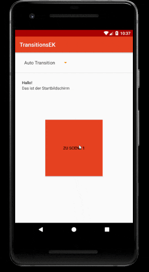

# Transition-Framework
## Nutzen
Ausarbeitung des [Transition Frameworks](https://developer.android.com/training/transitions) von Android.
## Funktionalitäten
Mittels Spinner kann jederzeit eine Transition ausgewählt werden. Mit dieser werden in einer fixen Reihenfolge Scenes durchlaufen. Detailliertere Infos dem [Protokoll](Protokoll/Trebicki-Transition-EK.md) entnehmen.
## Walkthrough

